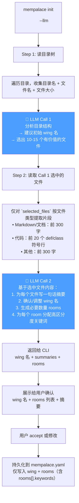

# MemPalace 中文支持增强方案（v4）

> **状态：已归档 ✅**
> 本方案已于 2026-04-13 全部实现并合并。所有变更已通过测试（95 tests passed）。
> 后续维护请直接参考源码；本文档仅作历史记录。

---

## 核心思路

中文项目支持差，根本原因有两层：

| 层 | 问题 | 解法 |
|---|---|---|
| **Embedding 层** | 默认模型不支持中文语义 | 已换为 `Qwen/Qwen3-Embedding-4B` |
| **分类层（init）** | 目录名/关键词匹配对中文项目失效 | `init --llm` 调用 LLM 生成 wing/rooms，并补充 `rooms[].keywords` |
| **路由层（mine）** | 依赖 `room.name + room.keywords` 字面匹配，质量取决于 init 产出 | 不改动，保留现有逻辑；依靠 init 提供高质量 room 关键词 |

**关键原则：`mine` 阶段不引入 LLM，保持 local-first、zero-API。**

---

## 变更一：默认 Embedding 模型

`config.py` 中已将默认模型改为 `Qwen/Qwen3-Embedding-4B`：

```python
# mempalace/config.py
DEFAULT_EMBEDDING_MODEL = "Qwen/Qwen3-Embedding-4B"
```

用户本地已安装该模型。无需额外配置即可获得中文语义检索能力。

> 若机器资源不足，可在 `~/.mempalace/config.json` 中手动降级为 `BAAI/bge-m3`（CPU 可跑，中文效果也很好）。

---

## 变更二：Init 阶段 — LLM 生成 wing + rooms

### 流程



无 `--llm` 时，流程与当前完全一致（目录结构映射，现有逻辑不变）。

### 文件内容提取策略

| 文件类型 | 提取方式 | 原因 |
|---|---|---|
| `.md` `.txt` `.html` 文档类 | 前 300 字 | 标题和摘要信息密度高 |
| `.py` `.js` `.ts` `.jsx` `.tsx` `.java` `.go` `.rs` `.rb` `.sh` 代码类 | 扫描全文，取前 20 个 `def ` / `class ` 定义行 | 文件头部通常是 import/license，定义行才有主题信息 |
| `.json` `.yaml` `.yml` `.toml` 配置类 | 前 300 字 | 配置文件结构即是内容 |
| `.csv` `.sql` 数据类 | 前 300 字（含表头/首行） | 表头最能说明数据主题 |
| 其他可读文件 | 前 300 字兜底 | — |

```python
def extract_file_snippet(filepath: Path, content: str) -> str:
    """按文件类型提取代表性片段，送给 LLM 分析。"""
    CODE_EXTS = {
        ".py", ".js", ".ts", ".jsx", ".tsx",
        ".java", ".go", ".rs", ".rb", ".sh",
    }
    if filepath.suffix.lower() in CODE_EXTS:
        lines = content.splitlines()
        symbols = [l for l in lines if l.strip().startswith(("def ", "class "))]
        if symbols:
            return "\n".join(symbols[:20])
    return content[:300]
```

### LLM Prompts

#### Call 1 — 分析目录结构，选出代表性文件

```
你是一个项目分析助手。

背景：MemPalace 是一个记忆索引系统：
- "wing"（翼）= 项目的唯一名称标识
- "room"（房间）= 项目内的主题分类，用于文件检索过滤

以下是项目的目录结构：
{directory_tree}

请：
1. 给这个项目起一个简洁名称（2-6个字，中英文均可），能概括项目主题
2. 选出 10-15 个最能体现项目内容的文件（优先 README、文档、核心源码）
3. 简要说明对这个项目的初步判断

JSON 格式返回（不要包含其他文字）：
{
  "wing_name": "...",
  "selected_files": ["path1", "path2", ...],
  "project_summary": "..."
}
```

#### Call 2 — 基于 `Call 1.selected_files` 生成摘要和 rooms

```
以下是 Call 1 选中的代表性文件，以及它们的内容片段。
项目的初始 wing 名候选为："{wing_name}"

selected_files:
{selected_files}

file_contents:
{file_contents}

请：
1. 为每个文件写一句话摘要（中文）
2. 确认或调整 wing 名称（2-6个字，中英文均可）
3. 将文件分组为 1-8 个主题 room，每个 room 提供：
   - 名称（2-6个字，中英文均可，简短清晰）
   - 一句话描述
   - 关键词列表（中英文混合；这是写入 `mempalace.yaml`、供 `mine` 阶段路由匹配使用的字段）
4. room 的关键词应尽量高区分度，避免把所有项目共通词重复分配给每个 room

JSON 返回（不要包含其他文字）：
{
  "wing_name": "...",
  "summaries": [{"file": "path", "summary": "..."}],
  "rooms": [
    {
      "name": "仿真平台",
      "description": "EXata仿真平台搭建与配置",
      "keywords": ["EXata", "仿真", "模型", "场景", "simulation"]
    }
  ]
}
```

---

## 变更三：`sanitize_name` 支持中文

当前 `_SAFE_NAME_RE` 只允许 ASCII 字母数字，中文 wing/room 名称会被拒绝。需要扩展正则以允许 Unicode 字符（中文、日文等），同时保留路径遍历防护。

```python
# config.py 修改
MAX_NAME_LENGTH = 128
_SAFE_NAME_RE = re.compile(
    r"^[\w\u4e00-\u9fff\u3400-\u4dbf]"   # 首字符：字母/数字/下划线/中文
    r"[\w\u4e00-\u9fff\u3400-\u4dbf _.'-]{0,126}"  # 中间字符
    r"[\w\u4e00-\u9fff\u3400-\u4dbf]?$",  # 末字符
    re.UNICODE,
)
```

保留的限制：
- 禁止 `..` `/` `\`（路径遍历）
- 禁止 null bytes
- 长度上限 128 字符

---

## 文件变更清单

| 文件 | 操作 | 说明 |
|---|---|---|
| `config.py` | **修改** | ① `DEFAULT_EMBEDDING_MODEL` 改为 `Qwen/Qwen3-Embedding-4B`；② `sanitize_name` 正则扩展支持 Unicode/中文 |
| `llm_client.py` | **新建** | OpenAI 兼容 API 客户端封装，含 JSON 容错解析和超时重试 |
| `llm_detector.py` | **新建** | init 阶段两步 LLM 检测逻辑 + `extract_file_snippet()` 提取策略 |
| `cli.py` | **修改** | `init` 子命令新增 `--llm` 参数，有 `--llm` 时走 `llm_detector`，否则走现有 `detect_rooms_local` |
| `room_detector_local.py` | **修改** | `FOLDER_ROOM_MAP` 补充常见中文目录名映射（如 `文档`→`documentation`、`源码`→`backend` 等） |
| `pyproject.toml` | **修改** | 新增可选依赖组：`pip install mempalace[llm]`，包含 `openai>=1.0` |

**不修改**：`miner.py`、`searcher.py`、`palace.py`、`knowledge_graph.py` 等——mine 阶段路由逻辑不变。

---

## LLM 配置

`~/.mempalace/config.json` 新增 `llm` 块：

```json
{
  "embedding_model": "Qwen/Qwen3-Embedding-4B",
  "llm": {
    "api_key": "sk-xxx",
    "base_url": "https://api.deepseek.com/v1",
    "model": "deepseek-chat"
  }
}
```

环境变量覆盖（优先级最高）：
- `MEMPALACE_LLM_API_KEY`
- `MEMPALACE_LLM_BASE_URL`
- `MEMPALACE_LLM_MODEL`

---

## 容错设计

- **LLM 调用失败**：单次超时/网络错误自动重试最多 2 次；仍失败则整个 `init --llm` 报错退出，并提示用户改用无参数的 `init`
- **JSON 解析失败**：尝试从响应中提取 JSON 片段（正则扫描 `{...}`）；彻底失败则报错退出
- **`openai` 未安装**：`llm_client.py` 顶部用 `try/except ImportError` 包裹，未安装时打印清晰提示（`pip install mempalace[llm]`），不影响无 LLM 的正常导入链

---

## 实现顺序（已全部完成 ✅）

1. ~~`config.py` — 改默认 embedding 模型 + `sanitize_name` Unicode 支持~~
2. ~~`llm_client.py` — API 封装 + JSON 容错~~
3. ~~`llm_detector.py` — 两步检测逻辑 + 文件片段提取~~
4. ~~`cli.py` — `init --llm` 接入；后续优化为有 LLM 配置时自动启用，`--local` 强制本地~~
5. ~~`room_detector_local.py` — 补充中文目录名映射~~
6. ~~测试验证（95 tests passed）~~

---

## 无 LLM 回退对照

| 阶段 | `--llm` | 无 `--llm` |
|---|---|---|
| init wing 名 | LLM 生成（中文友好） | 目录名（现有逻辑） |
| init rooms | LLM 生成（中文友好，含关键词） | 目录结构映射（现有逻辑） |
| mine 路由 | 不变，关键词字面匹配 | 不变，关键词字面匹配 |
| 检索 embedding | `Qwen/Qwen3-Embedding-4B`（中文语义） | 同左（默认已改） |

---

## 持久化输出

```
<project>/
└── mempalace.yaml      # wing + rooms（其中 rooms[].keywords 供 mine 路由使用）

~/.mempalace/
├── config.json         # 全局配置（含 embedding_model、llm 设置）
└── palace/             # ChromaDB 数据（向量 + metadata）
```
